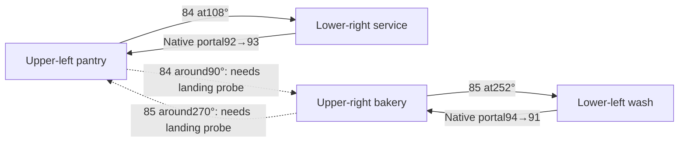

# Native cannon connectivity and outer-role options

This is a read-only planning analysis of the native initial snapshot and closed V13 trace. It does not establish a new transport route, a productive full round, or a high score.

## Native limits rule out a same-side descent

`artifacts/cycle-start.json` reports these limits and links:

| Cannon | Native yaw interval | Start yaw | Fire button | Current lower destination |
|---|---|---:|---:|---|
|84, upper-left|84.0029–108.0029°|90.0029°|78|Lower-right|
|85, upper-right|252.003235–276.003235°|270.003235°|77|Lower-left|

The installed game's decompiled `ServerPilotRotation.UpdateRotation` adds ordinary input times native delta to the relative angle, then clamps it to `PilotRotation.m_minLimitDegrees`/`m_maxLimitDegrees`. `ClientCannon.ApplyServerEvent` applies that launch yaw and calls `LaunchProjectile` with the cannon's child `Target` transform. There is no input-controlled launch-distance parameter in this path.

The initial native cannon-to-target horizontal distance is19.2400 units for both cannons. Rotating that measured displacement gives:

| Cannon/yaw | Derived target X,Z | Interpretation |
|---|---|---|
|84 /84.0029°|27.5347,−12.3898|Opposite upper platform candidate|
|84 /90.0029°|27.6400,−14.4010|Opposite upper platform candidate|
|84 /108.0029°|26.6980,−20.3464|Existing lower-right route|
|85 /252.003235°|14.1013,−20.3445|Existing lower-left route|
|85 /270.003235°|13.1600,−14.3989|Opposite upper platform candidate|
|85 /276.003235°|13.2655,−12.3878|Opposite upper platform candidate|

The two lower endpoints match the actual V13 final target telemetry within a few millionths of a unit. The opposite upper endpoints are geometric candidates only; they still need a native landing/control/held-item probe. Across the complete allowed intervals, cannon84's target stays on the right and cannon85's stays on the left. Neither can face180°, reach the same-side lower platform, or shorten its range to do so. `artifacts/v13-cannon-connectivity-observations.json` separates the native observations from these derived endpoints.

Native portal links complete two current outer work cycles:

The upper receiver portals have no player sender component. Their reverse links do not make the upper-to-lower direction available by walking into a portal.

## Cost of exchanging outer roles

An upper-right chef cannot take over lower-right service with one cannon. The proposed legal graph requires UR→UL→LR, using two cannons. Returning to bakery after service requires LR→UL by portal, followed by UL→UR by cannon. Cannon aiming also changes shared transport state, and a central chef must fire every launch. Swapping player identities between the current two cycles alone leaves the geographical supply/service and bakery/wash workloads unchanged.

A temporary strategy could send the bakery chef to UL while the normal left chef stays in LR for a larger service batch. It must already have sufficient native bakery stock and clean plates, then return a chef to UR→LL before dirty plates or the next donut become critical. That requires additional verified upper landings, aim coordination, inventory reservations and a native comparison. V13's very small later service waves also reflected meal readiness; another waiting service chef does not create those missing meals.

## Cheaper balancing candidate: washer-side plating

The more direct way to use an otherwise available washer is to assign preparation reachable from LL. Native counter50 at(15.6,−18) has measured ordinary approach points on both LL and the center, and is separate from dirty handoff46 and clean handoff44.

A bounded candidate could stage a completed unplated hotdog on50, have chef1 take one clean plate from native output76 and use the existing plate-under assembly action on50, then leave the same plated meal on50 for a center chef's condiment and service handoff. This keeps the current outer transport graph. It requires exact food/plate identities, counter ownership and final native composition proof, and should yield to immediate sink work or a FIFO bakery prerequisite. The plate-under mechanism is already proven on counters; this specific LL-side action chain still needs a native probe. It should initially cover complete unplated hotdogs, not broaden into unproven ingredient throwing or whole-bowl transfers.

The closed V13 prefix contains six completed `clear-clean-plate-handoff` jobs totaling12.55 central chef-seconds, before subsequent central plate retrieval/assembly. Seven washer `return-clean-plate` jobs total6.05 seconds, and seven `wash-one-native-plate` jobs total22.033 seconds. Washer-side assembly could remove the separate center clean-plate relocation and shift actual assembly to chef1; its benefit must be measured against any added prepared-food staging distance. `artifacts/v13-outer-job-audit.json` contains the ordinary completed outer jobs; delegated pantry-chop spans need their explicit handoff events when computing total utilization.

For the imminent V14 comparison, disabling the two raw sausage buffers and shared pantry chopping is a much smaller experiment than changing transport roles. It removes V13's approximately206 counter-lease-seconds of slow raw stock and keeps the pantry chef responsible for its existing chopping, while the current safety and identity fixes remain enabled.

## Local primary source references

The inspected installation sources are under `M:/projects/AssetRipper/Source/0Bins/AssetRipper.Tools.SystemTester/Release/Ripped/ExportedProject/Assets/Scripts/Assembly-CSharp`: `ServerPilotRotation.cs`, `PilotRotation.cs`, `ClientPilotRotation.cs`, `Cannon.cs`, and `ClientCannon.cs`. The source observations and native telemetry support the connectivity limits above; they do not establish performance for the proposed upper crossings or LL plating route.
